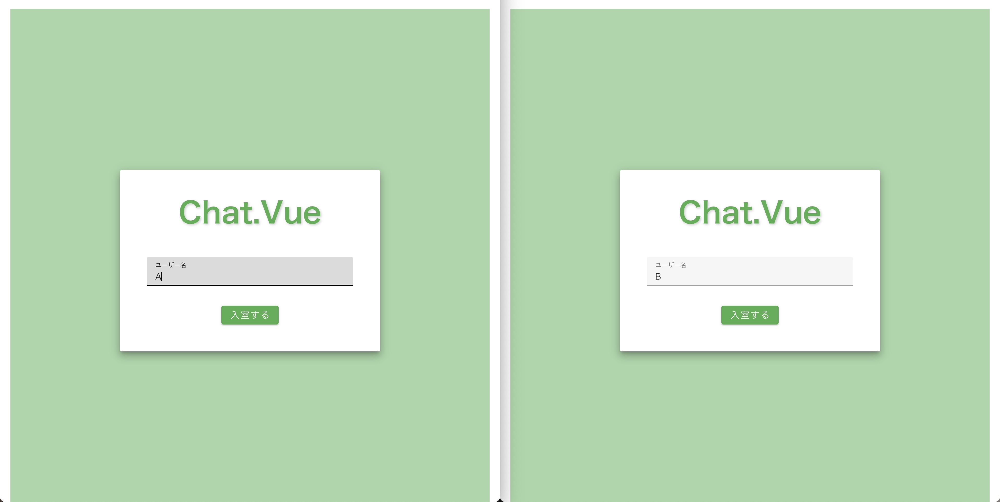
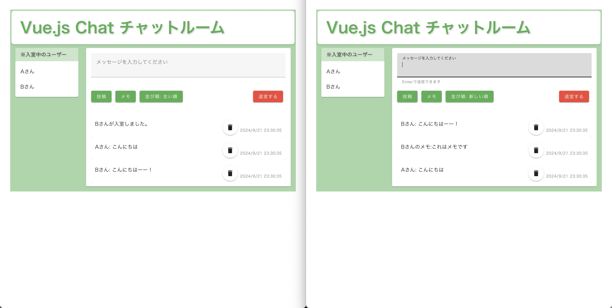

# Chat Application GUI

**注意:**  
このリポジトリには、ソースコードは含まれていません。 
このリポジトリはアプリケーションのデモや機能を紹介するためのものであり、ソースコードに関する問い合わせや配布はお受けできませんのでご了承ください

[**デモ動画はこちら**](https://github.com/rrr-1o23/chat-aplication-gui/issues/1#issue-2540406770)

### 使用技術

**フロントエンド**

**バックエンド**

 

**インフラ**

&nbsp;

<!--
 
-->

## 概要
このプロジェクトは、チーム開発で作成したリアルタイムチャットアプリケーションです。
フロントエンドにはVuetifyを採用し、モダンで直感的なUI/UXを実現しました。
リアルタイム通信にはSocket.IOを使用し、ユーザーがシームレスにメッセージを送受信できるよう設計しました。
さらに、クライアント側の負荷を軽減するため、可能な限りの処理をサーバー側で実施し、
これによりスケーラビリティとセキュリティを向上させています。
また、各機能はモジュール化されており、コードの再利用性と可読性を高める工夫も施しています。
これにより、メンテナンス性が向上し、将来的な拡張も容易です。

&nbsp;

## デモ画像

    
ログイン画面

    

&nbsp;

    
チャット画面

    

&nbsp;

## 機能

### 基本要件

#### ログイン画面

- ユーザ名が未入力で「入室する」が押されたらエラーダイアログを表示する

#### チャット画面

- ログイン画面で入力されたユーザ名に「さん」を加えて表示する
  - 入力：山田太郎
  - 表示：ログインユーザ：山田太郎さん
- 「投稿」ボタンでメッセージを投稿する
  - 投稿されたメッセージは自分を含め、すべてのクライアントに投稿者名とともに表示される
  - 例） ○○○○ さん：（投稿文）
- 「メモ」ボタンでメモを投稿する
  - 投稿されたメモは自分にだけ表示される
  - 例） ○○○○ さんのメモ：（投稿文）
- 投稿は新しい順に表示される
- ユーザの入退室時に自分を除いた他のクライアントに入退室のメッセージが表示される
  - 入室の例） ○○○○ さんが入室しました
  - 退室の例） ○○○○ さんが退室しました

### 追加要件

- 同じ名前での複数ログイン防止機能
- 投稿時刻表示機能
- Enterキーでの投稿
- 投稿の空送信の防止機能
- 並び替え機能
- 投稿の削除
- ログインユーザーリストの表示

​
